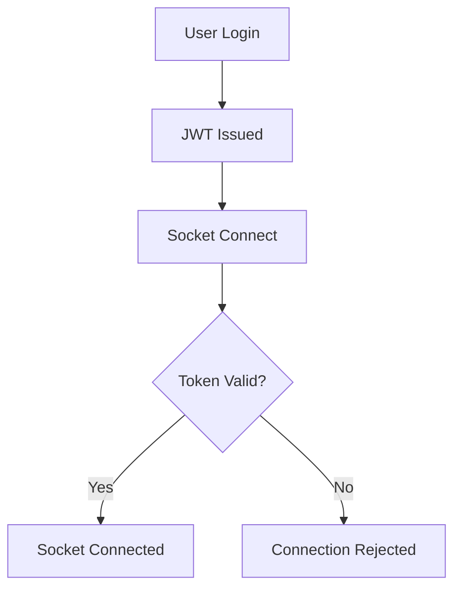
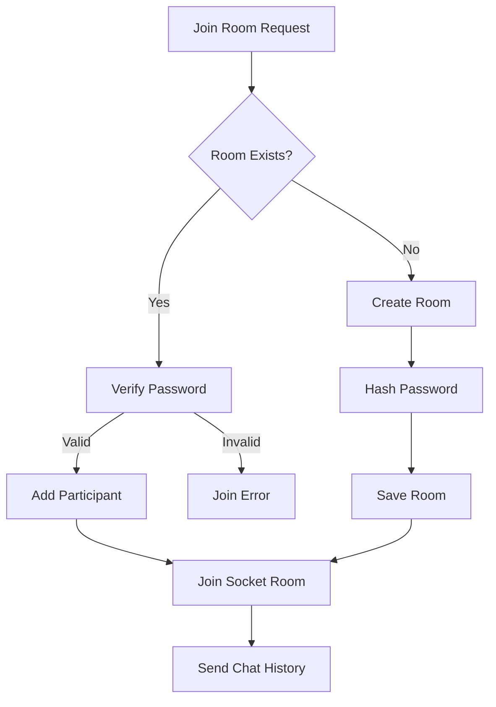
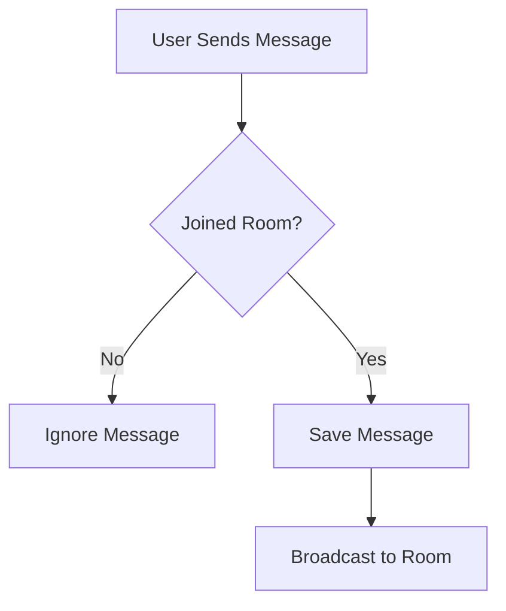
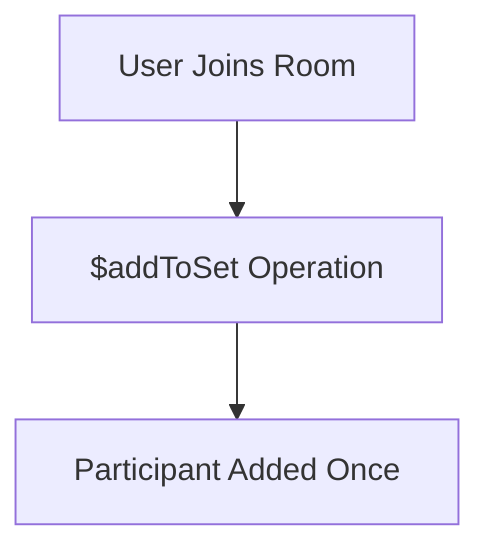

# 💬 Huddle — Secure Real-Time Chat App

<p align="center">
  <b>A secure, password-protected real-time chat application built with Socket.IO, React, and MongoDB.</b>
</p>

<p align="center">
  
  
  
  
  
</p>

---

## 🚀 Overview

**Huddle** allows authenticated users to create or join **secure chat rooms** using a **unique Room ID and password**.
Messages are delivered **in real time**, stored safely, and protected against unauthorized access.

This project focuses on **real-world backend safety**, including:

- concurrency handling
- atomic database updates
- socket authentication
- secure password hashing

---

## ✨ Key Features

### 🔐 Authentication

- JWT-based authentication
- Socket.IO authorization middleware
- Only authenticated users can connect

### 🏠 Secure Rooms

- Globally unique Room IDs
- Password-protected rooms
- Safe concurrent room creation
- Auto handling of race conditions

### 💬 Real-Time Chat

- Instant messaging via Socket.IO
- Message persistence in MongoDB
- Chat history loaded on join

### 👥 Participants Management

- Tracks room participants
- Prevents duplicate users using `$addToSet`
- Safe under refresh / reconnect

### 🎨 UI / UX

- Responsive design (desktop & mobile)
- Toast notifications (Toastify-JS)
- Disabled send button until room join completes
- Clean navigation and user identity display

---

## 🧱 Tech Stack

### Frontend

- React (Vite)
- React Router
- Tailwind CSS
- Socket.IO Client
- Toastify-JS

### Backend

- Node.js
- Express
- Socket.IO
- MongoDB
- Mongoose
- bcrypt
- JWT

---

## 📂 Project Structure

```bash
Chat/
├── backend/
│   ├── models/
│   │   ├── Room.js
│   │   └── Message.js
│   ├── socket/
│   │   └── chatSocket.js
│   ├── middleware/
│   │   └── authMiddleware.js
│   ├── server.js
│   └── .env
│
├── frontend/
│   ├── src/
│   │   ├── pages/
│   │   │   ├── Room.jsx
│   │   │   └── Chat.jsx
│   │   ├── socket.js
│   │   └── utils/toast.js
│   └── main.jsx
│
└── README.md
```

---

## 🗄️ Database Models

### 🏠 Room Model

```js
{
  roomId: String (unique),
  createdBy: String (email),
  passwordHash: String,
  participants: [String],
  timestamps
}
```

### 💬 Message Model

```js
{
  room: String,
  sender: String,
  text: String,
  createdAt: Date
}
```

---

## 🔁 Application Flowcharts

### 🔐 Authentication & Socket Connection



---

### 🏠 Room Join / Create Flow



---

### 💬 Message Flow



---

### 👥 Participant Handling (Concurrency Safe)



---

## 🔔 Toast Notifications

Toastify-JS is used for:

- Invalid room password
- Join failures
- Success messages
- API errors

Example:

```js
toast("Invalid room password", "error");
toast("Joined room successfully", "success");
```

---

## ▶️ Running Locally

### 1️⃣ Clone Repo

```bash
git clone https://github.com/your-username/huddle.git
cd huddle
```

### 2️⃣ Backend

```bash
cd backend
npm install
npm start
```

Create `.env`:

```env
MONGO_URI=your_mongodb_uri
JWT_SECRET=your_jwt_secret
```

### 3️⃣ Frontend

```bash
cd frontend
npm install
npm run dev
```

---

## 🧠 Engineering Highlights

- Atomic MongoDB updates (`$addToSet`)
- Secure password hashing (`bcrypt`)
- Socket authorization via JWT
- One-responsibility `useEffect` pattern
- Race-condition safe room creation

---

## 🔮 Future Improvements

- Auto rejoin after refresh (token-based)
- Online users list
- Typing indicators
- Room owner moderation
- Auto delete empty rooms
- End-to-end encryption

---

## 👨‍💻 Author

**Dipankar Sarkar**
Full-Stack Developer
Built as a real-world learning project focused on backend correctness and system design.

### 📧 Email
